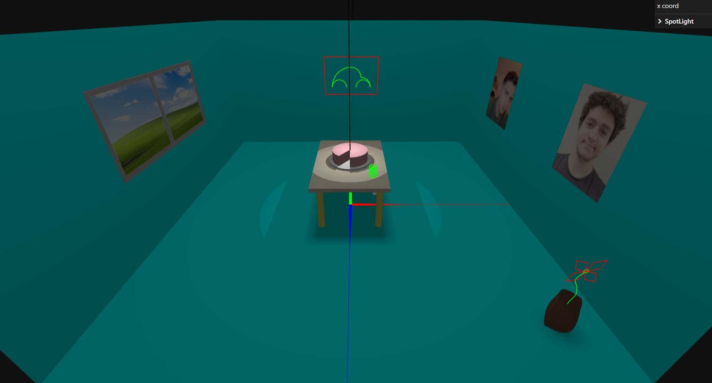

# SGI 2023/2024

## Group T01G10
| Name                         | Number    | E-Mail             |
| ---------------------------- | --------- | ------------------ |
| Eduardo Duarte da Silva      | 202004999 | 202004999@up.pt    |
| Adam Gershenson Nogueira     | 202007519 | 202007519@up.pt    |

----
## Project information

### Base description
This project was made in THREE.js in the context of the SGI unit of the MEIC course. The scene depicts a room, composed by geometry objects as well as nurbs and lines.
### Scene
The scene is composed by the following:
- A room, composed of 4 walls and a floor, all planes with similar textures.
- A table, with a paralelepipedal wooden top and cilindrical legs.
- A cake, on top of a plate, with a candle on fire on top.
- A slinky, on top of the table, composed by curved lines.
- A newspaper, in half-cane shape, supported at an angle by the table's leg, composed with a NURBS builder.
- A vase, also composed by a NURBS builder, with a flower inside. The flower is composed by curved and poly lines.
- A "Carrocha" painting, composed by curved lines.
- 2 portraits with each of the students.
- A window, with the famous Windows view.

Here is a screenshot depictiong all the mentioned elements:

The scene contains 2 light sources:
- one on top of the cake (to make it stand out).
- one parametrized, which can be controled through the UI.

We have also made sure all surfaces cast shadows, which can be checked (along with the parametrization of the spot light) in the following screenshot: 

The code is organized as instructed, but we divided most of the objects in four functions:

- buildRoom(): which builds the walls, floor, portraits and window. 
- buildSolids(): which builds the table, cake, plate and candle.
- buildCurves(): which builds curve related items, such as the slinky and the "Carrocha" painting.
- createNurbsSurfaces(): which builds the vase and the newspaper.
----
## Issues/Problems

- there were no unimplemented features or bugs in the code (that we know of)
- there are, however, a few code smells (such as the content class having all the code for every object), which we would like to have fixed if given more time.
