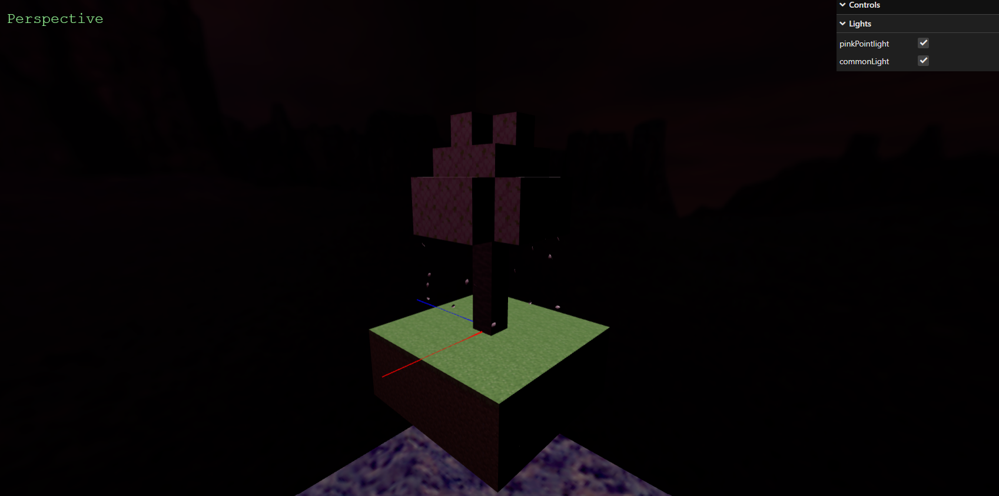

# SGI 2023/2024 - TP2

## Group T01G10
| Name                         | Number    | E-Mail             |
| ---------------------------- | --------- | ------------------ |
| Eduardo Duarte da Silva      | 202004999 | 202004999@up.pt    |
| Adam Gershenson Nogueira     | 202007519 | 202007519@up.pt    |

# Scene description

Inspired by the recent addition of Sakura trees to Minecraft, we made this scene depicting a Cherry Blossom Tree in a Skyblock setting. Following the game's style, most of the scene is composed by individual blocks, coming together to make something bigger. However, we also added 20 petal nurbs, which improves the scene in terms of ambience and complexity. Additionally, the scene is also illuminated by 2 lights, one of which has a pink hue, further enhancing the ambiance.

# Rendered Images

